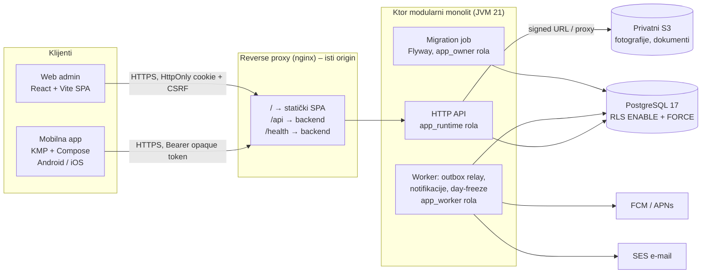
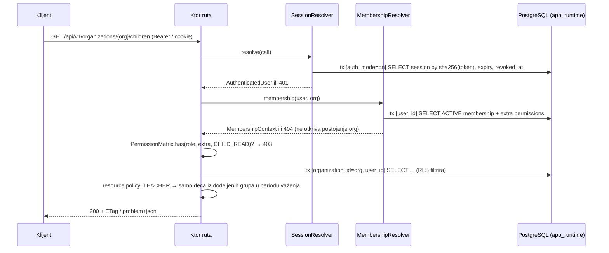

# Arhitektura sistema – Vrtić Connect (kindergarten-platform)

> Status: projektna dokumentacija za P0 pilot. Šta je stvarno implementirano u skeletonu i kako je provereno piše u [VALIDATION_REPORT.md](VALIDATION_REPORT.md). Odluke sa obrazloženjem su u [adr/](adr/).

## 1. Pregled

Vrtić Connect je višekorisnička (multi-tenant) SaaS platforma za privatne vrtiće. Jedan backend opslužuje mobilnu aplikaciju (roditelji i vaspitači) i web administraciju (vlasnici, administracija, platforma).



Ključne osobine:

- **Jedan backend, dva klijenta.** Promena koju roditelj napravi na telefonu odmah je vidljiva administraciji na webu, jer nema dupliranja poslovne logike u klijentima.
- **Modularni monolit.** Jedna JVM aplikacija podeljena na module (`auth`, `organizations`, `children`, `schedule`, `attendance`, `absence`, `announcements`, `notifications`, ...). Moduli komuniciraju kroz Kotlin interfejse i transakcioni outbox, ne kroz mrežu.
- **Izolacija tenant-a u bazi.** PostgreSQL Row Level Security je poslednja linija odbrane, uz aplikativne provere dozvola. Runtime rola nije vlasnik tabela i ne može zaobići RLS.
- **Tri procesa iz jedne slike.** `serve` (API), `migrate` (jedan migracioni job pre deploy-a), a kasnije `worker` (outbox relay). Svaki ima sopstvene DB kredencijale.

## 2. Repozitorijum (monorepo)

```
kindergarten-platform/
├── backend/            Ktor backend, sopstveni Gradle build (bez Android SDK)
├── apps/mobile/        KMP + Compose Multiplatform, sopstveni Gradle build
├── apps/admin-web/     React + Vite + TypeScript SPA
├── infrastructure/     nginx, Terraform/skripte (kasnije), runbook-ovi
├── docs/               specifikacija, arhitektura, šema, OpenAPI, ADR, validacija
├── scripts/            db/ (role, seed, RLS testovi), pomoćne skripte
├── docker-compose.yml  lokalni PostgreSQL 17 (+ opciono migrate/api u kontejneru)
├── .env.example        šablon lokalne konfiguracije
└── .github/workflows/  CI
```

Backend i mobile imaju **odvojene Gradle build-ove** namerno: backend CI ne sme zahtevati Android SDK, a mobile CI ne sme povlačiti serverske biblioteke. Zajednički DTO-ovi se ne dele kao Gradle modul između backend-a i mobile-a (različiti toolchain-ovi, različiti životni ciklusi); ugovor je OpenAPI, a DTO-ovi na obe strane su ručno održavani uz test kompatibilnosti (planirano u EPIC 02/03: generisanje Kotlin klijent-modela iz OpenAPI-ja se razmatra kada API stabilizuje).

## 3. Backend

### 3.1 Tehnologija

| Sloj | Izbor | Verzija | Napomena |
|---|---|---|---|
| Jezik / runtime | Kotlin / JDK | 2.3.21 / 21 (Temurin) | Kotlin verzija je ona sa kojom je Ktor 3.5.2 građen |
| HTTP | Ktor server (Netty) | 3.5.2 | plugin-ovi: ContentNegotiation, StatusPages, CallId, CallLogging, DefaultHeaders, Auth, RateLimit |
| Build | Gradle | 9.3.0 | maksimalna podržana za Kotlin 2.3.x |
| Baza | PostgreSQL | 17 | `postgres:17.11` lokalno |
| Pristup bazi | JDBC + HikariCP | 7.1.0 | eksplicitni SQL repository-ji, bez ORM-a |
| Migracije | Flyway | 13.7.0 | + `flyway-database-postgresql` |
| Lozinke | Argon2id (Bouncy Castle) | 1.86 | čist JVM, bez native biblioteka |
| Serijalizacija | kotlinx.serialization | 1.11.0 | isti format kao na mobile-u |
| Testovi | JUnit Jupiter + Ktor test host | 6.1.3 | integracioni testovi na pravom PostgreSQL-u |

Verzije su proverene 16. 9. 2026. iz Maven metapodataka i zvaničnih tabela kompatibilnosti (Ktor `libs.versions.toml`, kotlinlang „Gradle compatibility”). Zaključane su u `backend/gradle/libs.versions.toml`.

### 3.2 Ktor ili Spring Boot

Izabran je **Ktor** (ADR-0002). Sažetak:

| Kriterijum | Ktor | Spring Boot |
|---|---|---|
| Idiomatski Kotlin, coroutines | odlično, bez refleksije | dobro, ali JVM/Java-centrično |
| Vreme starta, memorija | nisko (bitno za male instance u pilotu) | veće |
| Bezbednosni ekosistem | ručno: sesije, CSRF, rate limit su naši moduli | Spring Security nudi gotove filtere, CSRF, session fixation zaštitu, OAuth2 |
| Tim | brzo učenje ako tim zna Kotlin | veliki broj developera zna Spring |
| Magija / eksplicitnost | eksplicitno | mnogo auto-konfiguracije |

**Spring Boot bi bio bolji izbor** ako: (a) tim već ima Spring iskustvo, a nema Kotlin/Ktor iskustvo; (b) hoćemo Spring Security kao proveren okvir za OAuth2/OIDC prijave (Google/Apple login kasnije), ili (c) planiramo mnogo integracija za koje Spring ima gotove starter-e. Naša auth strategija (opaque sesije, sopstveni token store, RLS kontekst po transakciji) je ionako custom, pa Spring Security ne bi uštedeo mnogo, dok bi dodao težinu. Ako se u EPIC 02 pokaže da je ručna implementacija sesija/CSRF-a rizična za tim, prelazak na Spring Boot je najjeftiniji pre nego što se napišu poslovni moduli.

### 3.3 Struktura koda

```
backend/src/main/kotlin/com/vrticconnect/
├── Main.kt                   ulaz: serve | migrate | benchmark-argon2
├── Application.kt            sastavljanje modula, AppDependencies (constructor injection)
├── config/AppConfig.kt       konfiguracija iz env promenljivih; bez default-a za tajne van DEV
├── db/
│   ├── DataSources.kt        Hikari pool-ovi: runtime (API) i owner (migrate)
│   ├── Database.kt           transaction(context) { conn -> } + DbContext → set_config(..., true)
│   └── Migrations.kt         Flyway sa owner rolom
├── http/Problem.kt           application/problem+json model i izuzeci
├── plugins/Plugins.kt        CallId, logovanje bez PII, StatusPages, zaglavlja, JSON
├── authz/Permissions.kt      Role, Permission, PermissionMatrix (izvor istine za SECURITY.md)
└── modules/
    ├── health/               /health/live, /health/ready
    ├── auth/                 rute (namerno 501), PasswordHasher (Argon2id), Tokens, SessionResolver
    └── tenant/               primer zaštićenog pipeline-a (/organizations/{id}/ping → 401)
```

Svaki poslovni modul (od EPIC 03) dobija isti raspored: `XRoutes.kt` (HTTP sloj, validacija, mapiranje na Problem), `XService.kt` (poslovna pravila, transakcije, audit, outbox), `XRepository.kt` (eksplicitni SQL nad `java.sql.Connection`), `XDtos.kt` (serializable modeli). Nema UseCase klase za svaki GET.

### 3.4 Pipeline jednog tenant zahteva



Redosled provera je bitan: **401 → 404 (tenant) → 403 (dozvola) → 404 (resurs van opsega)**. Tuđi tenant i tuđi resurs uvek daju 404, ne 403.

### 3.5 Transakcije i tenant kontekst

`Database.transaction(context) { conn -> ... }`:

1. uzme konekciju iz pool-a, `autoCommit=false`;
2. izvrši **jedan** `SELECT set_config('app.organization_id', ?, true), set_config('app.user_id', ?, true), set_config('app.auth_mode', ?, true), set_config('app.platform_mode', ?, true)` – sve četiri vrednosti eksplicitno, prazan string znači „nije postavljeno”;
3. izvrši blok; `COMMIT` ili `ROLLBACK`.

Pošto je `is_local = true`, PostgreSQL odbacuje vrednosti na kraju transakcije. Pool zato ne može da prenese kontekst u sledeći zahtev ni posle COMMIT-a ni posle ROLLBACK-a; to je dokazano integracionim testom `RlsIntegrationTest` (pool veličine 1). Kontekst se postavlja **tek posle** provere sesije i članstva, nikad iz zaglavlja zahteva.

### 3.6 Konkurentnost i idempotentnost

- **Optimistic concurrency**: tabele sa `version` kolonom vraćaju `ETag: "<version>"`; mutacije zahtevaju `If-Match`; neslaganje → `409` sa `currentVersion`.
- **Attendance**: komande nose `commandId` (UUID sa uređaja) i `expectedVersion`; server zaključava `attendance_days` red (`SELECT ... FOR UPDATE`), proverava verziju, upisuje nepromenljiv `attendance_events` red (`UNIQUE(command_id)` → ponovljeno slanje je `DUPLICATE`, ne novi događaj) i ažurira projekciju. Isti domen će kasnije koristiti QR/NFC/kiosk.
- **Ostale komande**: `Idempotency-Key` zaglavlje, čuvanje odgovora u `idempotency_keys` 24 h.
- **Outbox**: promena + `outbox_events` red u istoj transakciji; worker ih isporučuje (push, e-mail, invalidacija) uz retry/backoff i dead-letter.

### 3.7 Vreme i vremenske zone

- Instant događaja (`timestamptz`) je UTC. Datum rođenja je `date`. Raspored je lokalno vreme (`time`) + IANA zona organizacije (`organizations.timezone`, podrazumevano `Europe/Belgrade`; objekat može imati override).
- „Dan prisustva” (`attendance_days.attendance_date`) se određuje u zoni vrtića, čak i kada roditelj gleda iz druge zemlje.
- DST: nepostojeća vremena (prolećni skok) se pomeraju na prvo validno; dvosmislena (jesenji povratak) se rešavaju kao ranija ponuda – pravilo je implementirano na jednom mestu (`schedule` modul) i testira se.
- Promena zone organizacije ne menja istorijske redove: `daily_plans` i `attendance_days` čuvaju izračunate vrednosti (freeze).

## 4. Mobilna aplikacija (sažetak; detaljno u [MOBILE_ARCHITECTURE.md](MOBILE_ARCHITECTURE.md))

Kotlin Multiplatform + Compose Multiplatform. Deli se: DTO i serijalizacija, API klijent (Ktor Client), auth koordinacija (single-flight refresh), validacija, poslovna pravila (brojači dnevnog pregleda), stanje ekrana, navigacija i UI. Platformski deo: Keychain/Keystore, push, sistemske dozvole, kamera/izbor fotografija, lifecycle, crash reporting. Offline P0: pročitani snapshot dece/rasporeda/prisustva sa TTL 12 h i red pending attendance komandi; bez last-write-wins.

## 5. Web administracija (sažetak; detaljno u [WEB_ARCHITECTURE.md](WEB_ARCHITECTURE.md))

React 19 + TypeScript strict + Vite SPA, servirana sa istog origin-a kao API preko nginx-a. HttpOnly/Secure/SameSite kolačići + CSRF token + exact Origin provera. TanStack Query ključevi su vezani za `userId + organizationId`; promena tenant-a briše keš. Bez tokena u `localStorage`.

## 6. Podaci (sažetak; detaljno u [DATABASE.md](DATABASE.md))

Jedna baza, shared schema `app`, `organization_id` na svim tenant tabelama, kompozitni FK `(id, organization_id)`, RLS ENABLE + FORCE na svim tenant tabelama, posebne politike za globalne tabele (`users`, `sessions`, tokeni) sa `auth_mode`, i `platform_mode` za SUPER_ADMIN operacije. Tri DB role: `app_owner` (migracije), `app_runtime` (API), `app_worker` (relay). Vlasnik tabela je i sam vezan RLS-om (FORCE) i mora eksplicitno ući u `maintenance_mode` po transakciji.

## 7. Bezbednost (sažetak; detaljno u [SECURITY.md](SECURITY.md))

Opaque sesije (access 10 min, refresh 30 d / 7 d idle, rotacija, detekcija ponovne upotrebe), Argon2id, MFA za platformu/vlasnike/support, RLS + aplikativne politike, šifrovanje zdravstvenih podataka (envelope), audit append-only, sanitizovani logovi, privatni storage sa kratkotrajnim signed URL-ovima.

## 8. Realtime i notifikacije

Za pilot: klijenti osvežavaju polling-om u kratkim intervalima kada je ekran aktivan, a push poruka (sa minimalnim opaque ID-jem) služi kao invalidacija. SSE za attendance invalidaciju, poruke i badge se dodaje kada donese merljivu korist; WebSocket se ne uvodi bez potrebe. Stream mora poštovati opoziv sesije i promene dozvola (server zatvara stream), a reconnect radi catch-up preko REST-a.

## 9. Okruženja i isporuka (sažetak; detaljno u [INFRASTRUCTURE.md](INFRASTRUCTURE.md))

DEV (Docker Compose), STAGING i PRODUCTION (AWS EU). Immutable Docker slika; jedan `migrate` job pre `serve`; expand/contract migracije; rollback aplikacije bez slepog vraćanja migracija.

## 10. Šta skeleton NE sadrži (namerno)

- Nikakvu prijavu: `/api/v1/auth/*` vraća `501` sa problem+json; ne postoje razvojne prečice.
- Nikakve poslovne rute; `/organizations/{id}/ping` postoji samo kao primer pipeline-a i vraća `401`.
- Worker proces, S3, push, e-mail – projektovani, nisu u skeletonu.
- Mobilni i web klijenti imaju samo ljusku (ekran, lokalizacija, health poziv, forma prijave koja prikazuje 501).

## 11. Rizici i otvorena pitanja arhitekture

| Rizik | Ublažavanje |
|---|---|
| Opaque access token = DB lookup na svakom zahtevu | Indeks po hash-u, kratak TTL, kasnije lokalni keš od nekoliko sekundi sa eksplicitnom invalidacijom; prelazak na potpisane tokene tek uz istu online proveru opoziva |
| RLS politike sa podupitima (`users`, `organizations`) mogu biti spore | Indeksi na `organization_memberships(user_id)`/(org, role); merenje u EPIC 03 |
| Compose Multiplatform na iOS-u je mlađi | iOS build gate na macOS runner-u od EPIC 01; UI testovi na pravim uređajima u pilotu |
| Jedan proces za API i worker u pilotu | Worker je odvojen po roli i komandi od početka, pa se izdvaja bez promene koda |
