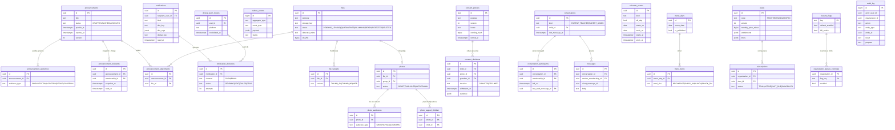

# ER dijagram – obaveštenja, notifikacije, fajlovi, fotografije, saglasnosti, poruke, pretplata

Izvor: [database/schema.sql](../database/schema.sql).

```mermaid
erDiagram
    announcements {
        uuid id PK
        text title
        text status "DRAFT|PUBLISHED|ARCHIVED"
        timestamptz publish_at
        timestamptz expires_at
        int version
    }
    announcement_audiences {
        uuid id PK
        uuid announcement_id FK
        text audience_type "ORGANIZATION|LOCATION|GROUP|GUARDIAN"
    }
    announcement_recipients {
        uuid id PK
        uuid announcement_id FK
        uuid membership_id FK
        timestamptz snapshot_at
        timestamptz read_at
    }
    announcement_attachments {
        uuid id PK
        uuid announcement_id FK
        uuid file_id FK
    }
    notifications {
        uuid id PK
        uuid recipient_user_id FK
        text kind
        text title_key
        jsonb title_args
        text dedup_key
        timestamptz read_at
    }
    device_push_tokens {
        uuid id PK
        uuid user_id FK
        text platform
        timestamptz invalidated_at
    }
    notification_deliveries {
        uuid id PK
        uuid notification_id FK
        text channel "PUSH|EMAIL"
        text status "PENDING|SENT|FAILED|DEAD"
        int attempts
    }
    outbox_events {
        bigint id PK
        text aggregate_type
        text event_type
        jsonb payload
        text status
    }
    files {
        uuid id PK
        text purpose
        text storage_key
        text status "PENDING_UPLOAD|QUARANTINED|SCANNING|READY|REJECTED|DELETED"
        text detected_mime
        bytea sha256
    }
    file_variants {
        uuid id PK
        uuid file_id FK
        text variant "THUMB_SM|THUMB_MD|WEB"
    }
    photos {
        uuid id PK
        uuid file_id FK
        uuid group_id FK
        text status "DRAFT|PUBLISHED|WITHDRAWN"
    }
    photo_audiences {
        uuid id PK
        uuid photo_id FK
        text audience_type "GROUP|CHILD|GUARDIAN"
    }
    photo_tagged_children {
        uuid id PK
        uuid photo_id FK
        uuid child_id FK
    }
    consent_policies {
        uuid id PK
        text purpose
        int version
        text locale
        bytea wording_hash
        timestamptz retired_at
    }
    consent_decisions {
        uuid id PK
        uuid child_id FK
        uuid policy_id FK
        uuid guardian_id FK
        text decision "GRANTED|DECLINED"
        timestamptz withdrawn_at
        jsonb evidence
    }
    conversations {
        uuid id PK
        text kind "PARENT_TEACHER|PARENT_ADMIN"
        uuid child_id FK
        timestamptz last_message_at
    }
    conversation_participants {
        uuid id PK
        uuid conversation_id FK
        uuid membership_id FK
        timestamptz left_at
        uuid last_read_message_id FK
    }
    messages {
        uuid id PK
        uuid conversation_id FK
        uuid sender_membership_id FK
        uuid client_message_id
        text body
    }
    calendar_events {
        uuid id PK
        text kind
        bool all_day
        date starts_on
        date ends_on
        timestamptz starts_at
        timestamptz ends_at
    }
    menu_days {
        uuid id PK
        date menu_date
        bool is_published
    }
    menu_items {
        uuid id PK
        uuid menu_day_id FK
        text meal_slot "BREAKFAST|SNACK_AM|LUNCH|SNACK_PM"
    }
    plans {
        uuid id PK
        text code "STARTER|STANDARD|PRO"
        int version
        bigint monthly_price_minor
        jsonb entitlements
        jsonb limits
    }
    subscriptions {
        uuid id PK
        uuid organization_id FK
        uuid plan_id FK
        text status "TRIAL|ACTIVE|PAST_DUE|CANCELLED"
    }
    feature_flags {
        text key PK
        bool default_enabled
        bool kill_switch
    }
    organization_feature_overrides {
        uuid organization_id PK
        text flag_key PK
        bool enabled
    }
    audit_log {
        bigint id PK
        uuid actor_user_id
        uuid organization_id
        text action
        text entity_type
        uuid entity_id
        text result
        text purpose
    }

    announcements ||--|{ announcement_audiences : "publika (pravilo)"
    announcements ||--o{ announcement_recipients : "snapshot + čitanje"
    announcements ||--o{ announcement_attachments : "prilozi"
    files ||--o{ announcement_attachments : ""
    notifications ||--o{ notification_deliveries : "isporuke"
    device_push_tokens |o--o{ notification_deliveries : "push cilj"
    files ||--o{ file_variants : "thumbnails"
    files ||--o| photos : "fotografija"
    photos ||--|{ photo_audiences : "ko sme da vidi"
    photos ||--o{ photo_tagged_children : "prepoznatljiva deca"
    consent_policies ||--o{ consent_decisions : "odluke po verziji"
    conversations ||--|{ conversation_participants : "server-managed"
    conversations ||--o{ messages : "poruke"
    menu_days ||--|{ menu_items : "obroci"
    plans ||--o{ subscriptions : "verzija plana"
    feature_flags ||--o{ organization_feature_overrides : "override po vrtiću"
```
