# ER dijagram – identitet, organizacije, struktura, deca

Izvor: [database/schema.sql](../database/schema.sql). Prikazane su ključne kolone; sve tenant tabele imaju `organization_id` i `UNIQUE (id, organization_id)`.

```mermaid
erDiagram
    users {
        uuid id PK
        citext email UK
        text password_hash "Argon2id, NULL dok nije postavljena"
        text status
        text preferred_locale
    }
    sessions {
        uuid id PK
        uuid user_id FK
        text client_kind "WEB|ANDROID|IOS"
        timestamptz absolute_expires_at
        timestamptz revoked_at
        timestamptz mfa_verified_at
    }
    refresh_tokens {
        uuid id PK
        uuid session_id FK
        bytea token_hash UK
        timestamptz consumed_at
        uuid replaced_by_id FK
        timestamptz reuse_detected_at
    }
    access_tokens {
        uuid id PK
        uuid session_id FK
        bytea token_hash UK
        timestamptz expires_at
    }
    platform_admins {
        uuid user_id PK
        timestamptz revoked_at
    }
    organizations {
        uuid id PK
        citext slug UK
        text name
        text timezone
        text status
    }
    organization_settings {
        uuid organization_id PK
        int schedule_change_deadline_hours
        int late_arrival_grace_minutes
    }
    organization_memberships {
        uuid id PK
        uuid organization_id FK
        uuid user_id FK
        text role "OWNER|ADMIN|TEACHER|PARENT"
        text status "INVITED|ACTIVE|SUSPENDED|REVOKED"
    }
    membership_permissions {
        uuid id PK
        uuid membership_id FK
        text permission
        timestamptz revoked_at
    }
    invitations {
        uuid id PK
        uuid organization_id FK
        citext email
        text role
        uuid child_id FK
        bytea token_hash UK
    }
    support_access_grants {
        uuid id PK
        uuid organization_id FK
        uuid support_user_id FK
        text ticket_ref
        text[] scope
        timestamptz expires_at
    }
    locations {
        uuid id PK
        uuid organization_id FK
        text name
    }
    groups {
        uuid id PK
        uuid organization_id FK
        uuid location_id FK
        text name
        int capacity
    }
    employees {
        uuid id PK
        uuid membership_id FK
        text display_name
    }
    group_teacher_assignments {
        uuid id PK
        uuid group_id FK
        uuid employee_id FK
        date valid_from
        date valid_to
    }
    children {
        uuid id PK
        uuid organization_id FK
        text given_name
        text family_name
        date date_of_birth
        uuid photo_file_id FK
        int version
    }
    enrollments {
        uuid id PK
        uuid child_id FK
        uuid group_id FK
        date valid_from
        date valid_to
        text status
    }
    guardians {
        uuid id PK
        uuid child_id FK
        uuid membership_id FK
        text status "PENDING|CONFIRMED|REVOKED"
        bool can_manage_schedule
        bool can_report_absence
        bool can_give_consent
    }
    pickup_persons {
        uuid id PK
        uuid child_id FK
        text full_name
        text status
    }
    child_health_profiles {
        uuid child_id PK
        bytea payload_enc "envelope encrypted"
        text payload_key_id
        bool has_critical_alert
    }

    users ||--o{ sessions : "prijavljen na"
    sessions ||--o{ refresh_tokens : "rotira"
    sessions ||--o{ access_tokens : "izdaje"
    users ||--o| platform_admins : "SUPER_ADMIN"
    users ||--o{ organization_memberships : "član"
    organizations ||--o{ organization_memberships : "ima"
    organizations ||--|| organization_settings : "podešavanja"
    organization_memberships ||--o{ membership_permissions : "dodatne permisije"
    organizations ||--o{ invitations : "poziva"
    organizations ||--o{ support_access_grants : "odobrava"
    organizations ||--o{ locations : "objekti"
    locations ||--o{ groups : "grupe"
    organization_memberships ||--o| employees : "profil zaposlenog"
    employees ||--o{ group_teacher_assignments : "dodeljen"
    groups ||--o{ group_teacher_assignments : "vaspitači"
    organizations ||--o{ children : "deca"
    children ||--o{ enrollments : "upisi"
    groups ||--o{ enrollments : "u grupi"
    children ||--o{ guardians : "staratelji"
    organization_memberships ||--o{ guardians : "PARENT veza"
    children ||--o{ pickup_persons : "ovlašćeni"
    children ||--o| child_health_profiles : "zdravlje"
    children ||--o{ invitations : "poziv staratelja"
```

