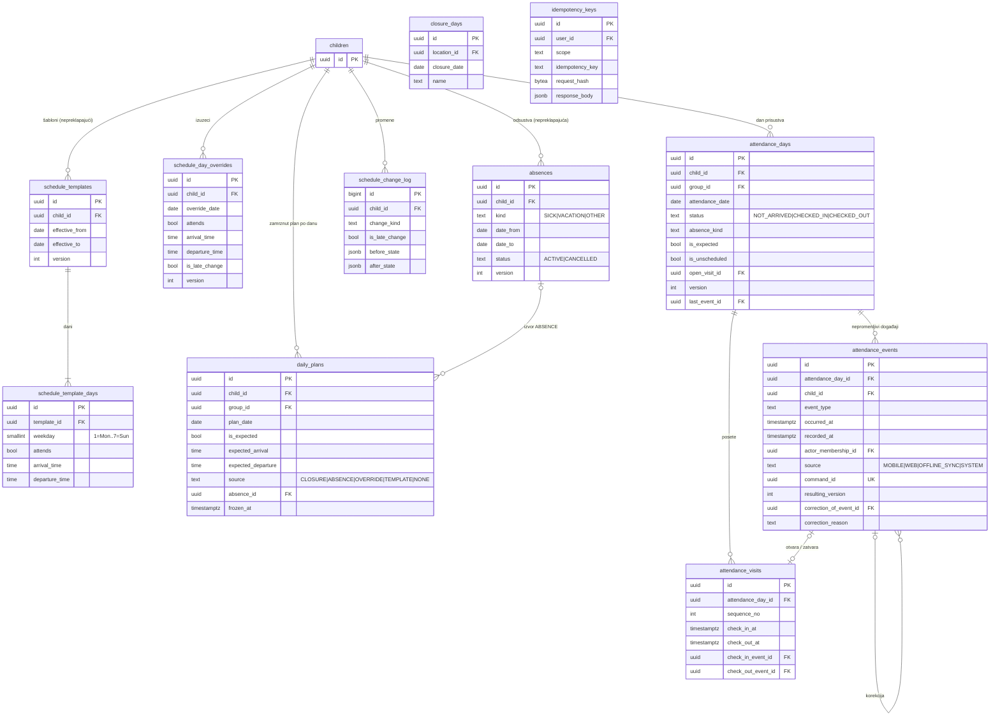
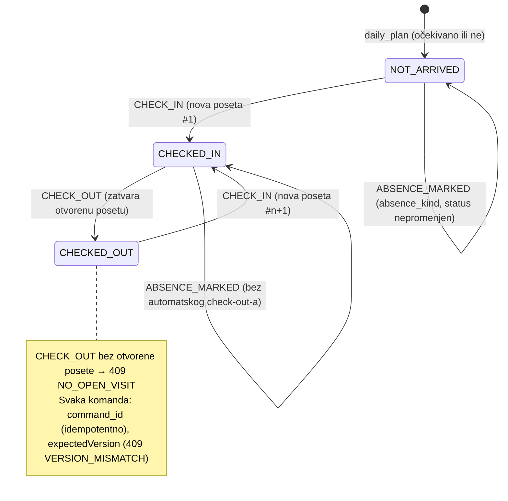
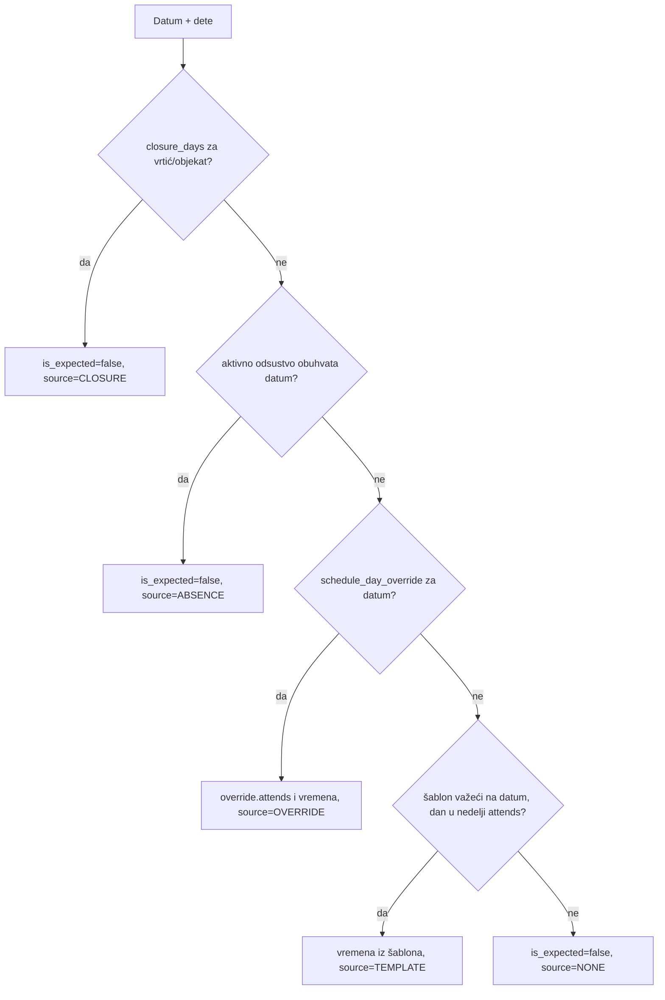

# ER dijagram – raspored, odsustva, prisustvo

Izvor: [database/schema.sql](../database/schema.sql).

```mermaid
erDiagram
    children {
        uuid id PK
    }
    schedule_templates {
        uuid id PK
        uuid child_id FK
        date effective_from
        date effective_to
        int version
    }
    schedule_template_days {
        uuid id PK
        uuid template_id FK
        smallint weekday "1=Mon..7=Sun"
        bool attends
        time arrival_time
        time departure_time
    }
    schedule_day_overrides {
        uuid id PK
        uuid child_id FK
        date override_date
        bool attends
        time arrival_time
        time departure_time
        bool is_late_change
        int version
    }
    closure_days {
        uuid id PK
        uuid location_id FK
        date closure_date
        text name
    }
    absences {
        uuid id PK
        uuid child_id FK
        text kind "SICK|VACATION|OTHER"
        date date_from
        date date_to
        text status "ACTIVE|CANCELLED"
        int version
    }
    daily_plans {
        uuid id PK
        uuid child_id FK
        uuid group_id FK
        date plan_date
        bool is_expected
        time expected_arrival
        time expected_departure
        text source "CLOSURE|ABSENCE|OVERRIDE|TEMPLATE|NONE"
        uuid absence_id FK
        timestamptz frozen_at
    }
    schedule_change_log {
        bigint id PK
        uuid child_id FK
        text change_kind
        bool is_late_change
        jsonb before_state
        jsonb after_state
    }
    attendance_days {
        uuid id PK
        uuid child_id FK
        uuid group_id FK
        date attendance_date
        text status "NOT_ARRIVED|CHECKED_IN|CHECKED_OUT"
        text absence_kind
        bool is_expected
        bool is_unscheduled
        uuid open_visit_id FK
        int version
        uuid last_event_id FK
    }
    attendance_visits {
        uuid id PK
        uuid attendance_day_id FK
        int sequence_no
        timestamptz check_in_at
        timestamptz check_out_at
        uuid check_in_event_id FK
        uuid check_out_event_id FK
    }
    attendance_events {
        uuid id PK
        uuid attendance_day_id FK
        uuid child_id FK
        text event_type
        timestamptz occurred_at
        timestamptz recorded_at
        uuid actor_membership_id FK
        text source "MOBILE|WEB|OFFLINE_SYNC|SYSTEM"
        uuid command_id UK
        int resulting_version
        uuid correction_of_event_id FK
        text correction_reason
    }
    idempotency_keys {
        uuid id PK
        uuid user_id FK
        text scope
        text idempotency_key
        bytea request_hash
        jsonb response_body
    }

    children ||--o{ schedule_templates : "šabloni (nepreklapajući)"
    schedule_templates ||--|{ schedule_template_days : "dani"
    children ||--o{ schedule_day_overrides : "izuzeci"
    children ||--o{ absences : "odsustva (nepreklapajuća)"
    children ||--o{ daily_plans : "zamrznut plan po danu"
    absences |o--o{ daily_plans : "izvor ABSENCE"
    children ||--o{ schedule_change_log : "promene"
    children ||--o{ attendance_days : "dan prisustva"
    attendance_days ||--o{ attendance_visits : "posete"
    attendance_days ||--o{ attendance_events : "nepromenljivi događaji"
    attendance_events |o--o| attendance_visits : "otvara / zatvara"
    attendance_events |o--o{ attendance_events : "korekcija"
```

## Stanja prisustva

```mermaid
stateDiagram-v2
    [*] --> NOT_ARRIVED : daily_plan (očekivano ili ne)
    NOT_ARRIVED --> CHECKED_IN : CHECK_IN (nova poseta #1)
    CHECKED_IN --> CHECKED_OUT : CHECK_OUT (zatvara otvorenu posetu)
    CHECKED_OUT --> CHECKED_IN : CHECK_IN (nova poseta #n+1)
    NOT_ARRIVED --> NOT_ARRIVED : ABSENCE_MARKED (absence_kind, status nepromenjen)
    CHECKED_IN --> CHECKED_IN : ABSENCE_MARKED (bez automatskog check-out-a)
    note right of CHECKED_OUT
        CHECK_OUT bez otvorene posete → 409 NO_OPEN_VISIT
        Svaka komanda: command_id (idempotentno), expectedVersion (409 VERSION_MISMATCH)
    end note
```

## Prioritet izračuna dnevnog plana

```mermaid
flowchart TD
    A[Datum + dete] --> B{closure_days za vrtić/objekat?}
    B -- da --> Z1[is_expected=false, source=CLOSURE]
    B -- ne --> C{aktivno odsustvo obuhvata datum?}
    C -- da --> Z2[is_expected=false, source=ABSENCE]
    C -- ne --> D{schedule_day_override za datum?}
    D -- da --> Z3[override.attends i vremena, source=OVERRIDE]
    D -- ne --> E{šablon važeći na datum, dan u nedelji attends?}
    E -- da --> Z4[vremena iz šablona, source=TEMPLATE]
    E -- ne --> Z5[is_expected=false, source=NONE]
```
